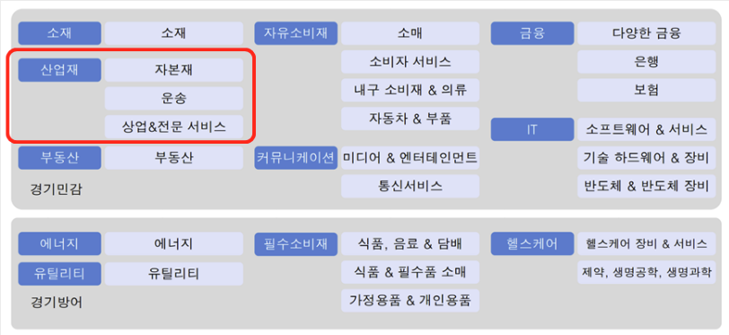

##Sector

## 대하락장 방어 (180)
1.금 - 일반장에선 별로
2.미국장기채 - 미국채는 spy와 상관성이 +이지만 한국은 원-달러떄문에 ㄱㅊ
3.절대모멘텀 - 최근 1/3/12개월 대비 수익이 +면 매, -면 공매도(인버스)

=> 자산배분: 미채권, 금은 원래 포함
=> 주식비율에서 절대모멘텀돌리기

---
## 절대모멘텀
상승장 매수, 하락장 매도
* 수익 증가 없음,MDD 대폭하락 (특히 포트폴리오 단위에서) 
* 17,18,21

---
## 상대모멘텀

**1월엔 하지마라 (원논문)**
**2-12월**

상대적으로 최근 많이 오른놈 매수
* 수익증가, MDD 도움안됨 
* 8,9,14

---
## 듀얼모멘텀
모멘텀기준 = 12개월 모멘텀(1년 전 가격과 비교) 
3,6,9도 가능함

평상시 = 상대모멘텀
하락장 = 현금보유

하락장에는 금+미국채 듀얼모멘텀 써보자

---
## LDD  VDD

## GTAA

---
## To Do List

* 2022-01-08
  * ~~buy-sell 반복 시뮬레이션~~
  * ~~date 넘기는 기능~~

* 2022-01-09
  * ~~buy-sell시 퍼센트로 계산~~
  * ~~buy-sell시 비율 지키면서 계산~~

* 2022-01-10
  * ~~Max Drawdown (MDD) 계산~~
  * ~~미국etf로 시뮬레이션돌리기 <= Backdata부족~~

* 2022-01-11
  * ~~portpolio correation~~
  * ~~2018-02-05 to 2019-01-06 코스피 넣고 헷지되는거 찾기~~
    ~~* 신흥국지수 ETF로 correation 보고 Kospi 대체 (국내 데이터가 없음)~~

* 2022-01-12
  * ~~trade/year = 2인 리벨런싱 함수 만들기~~
    * ~~기준일에 자산합계후 비율대로 매수/매도 하기~~

* 2022-01-16
  * report pdf 생성
  * ~~random일에 매수 했을 때 mdd 시뮬레이션~~
  * ~~환율연동 매수매도~~

* 2022-01-18
  * ~~현금일 경우 예적금 금리반영~~ 
    * cma금리 연 1.20% :  (cash*(1.012)/365) * days = 이자로 계산
    * https://www.shinhaninvest.com/siw/wealth-management/cma/cma-simulation/view.do
  * ~~외환시장과 미장/국장 date가 다름 => plot시 고려해야함~~
  * ~~CAGR로 결과 계산~~
  * ~~AW4/11 vs B&H plotting~~
  * 이평선추가 
  * ~~포트폴리오별 correation 측정~~

* 2022-01-25
  * all-weather 진입 시점 찾아보기 
    * DBC와 직접만든 DBC correlation 비교해보셈
  * quant연구 시작
    * 유동성에 따른 상승여력 (양적긴축대비)
    * 하락장에서 신용비율 연구 (vix, 환율, ...)
    * 최근 한달간 이슈에 따른 원자재,금,채권 움직임 분석

    * 2017년의 달러인덱스를 보자
      * 2017년에 미국 4번 금리인상 but, 102 -> 88
        * 경제성장률에선 유럽이 미국보다 좋았음
        * 연준의 통화정책은 다알았지만 20위?총재가 우리도 통화정책할수있어
    * forward PBR = 2780
      * but 확정실적은 2630 정도임
    * 물류관련데이터가 필요함 (병목현상 여전히 심함)-> 사람부족

  * GDP가 제일 중요함 but 3개월 단위기 때문에 여러가지 지표들을 발표하는거임
    * 기존엔 실업률 지표를 봤었음 그러나 3개월전이라 .. 다음 2개를 봐야함
      * ISM 제조업지표 (중국 한국 일본 독일) - 2월초에 나옴 
      * 소비지표  
    * 중국 한국 독일 일본의 수출비용이 존나높은데 미국의 cpi-ppi는 낮음. 즉, 소비자한테 비용전가를 못하면 다음 제무재표때 다 손실로잡힘
    * GDP 추정치 4.5->2.7% 유동성없었으면 이것만으로 20~30퍼 작살나야됬음
    * 미국의 신용잔고 (lofty leverage) 너무 높음

  * 현재 금리 위기임 <= 기업실적 박살나면 S&P Earn Yield가 아작남 (일드커드 인버젼 S&P 500 dividend yield)
    * Effective Fed Funds Rate --> 0.08%
    * CPI YoY  --> 6.8%
    * Real Fed Funds Rate --> -6.72% 
    => cpi 3%대와도 기준금리 2.5~3까진 가져야함

  * 인플레는 2가지 경로로 적용됨
    * 자산은 3가지 채권, 주식, 부동산이고 양적긴축하면 채권부터 팔아재낌
    * 1. Theoretical impact of instantaneous rise in bond yield (금융시장의 인플레적용)
      * +100bp -> PE=10(한국): -10%
      * +100bp -> PE=30(미국): -20~25%
    * 2. 실물자산

  * 결론
    * 인플레이션 잡으려면 단기금리를 땡겨야됨 (75~100bp)
    * 근데 장기금리가 안오르면 경기가 나쁘다는것, ism제조업지표+소비업지표로 경기전망함.
    * 단기땡기고 10년물 내려옴 --> 유동성때문에 그랬다 하지만 이젠 10년물 올려서 실물이 살아나야함.
      * 그렇지 않을 경우 yield curver inversion이 박살남

* 2022-01-31:
  * 기술적분석 (전고돌파) 찾기, 변곡점기준
  * 평균모멘텀 스코어로 주식비중

* 2022-02-08:
  * 4-11 적용해보기
    * 11-4 = gold + share
    * 4-11 = ief

---
# Asset Allocation

> https://www.youtube.com/watch?v=X8da7f3-0g0
> https://allocatesmartly.com/members/cluster-analysis/

## 1. Fast Tactical
### 1.1 Vigiant AA-Aggressive (VAA-Aggressive)
### 1.2 Vigiant AA-Balanced (VAA-Blanced)
### 1.3 Accelerting Dual-Momentum
### 1.4 DAA
카나리아 자산군 VWO, BND

---
## 2. Primarily passive
### 2.1 Permanent Protfolio

### 2.2 Lazy Asset Allocation (LAA)

---
## 3. Slow Tactical
### 3.1 Composite Dual-Momentum 

---

연기금 + 사모펀드 + 투신 각 200억매수 = 코스닥안정

분배금 스케쥴